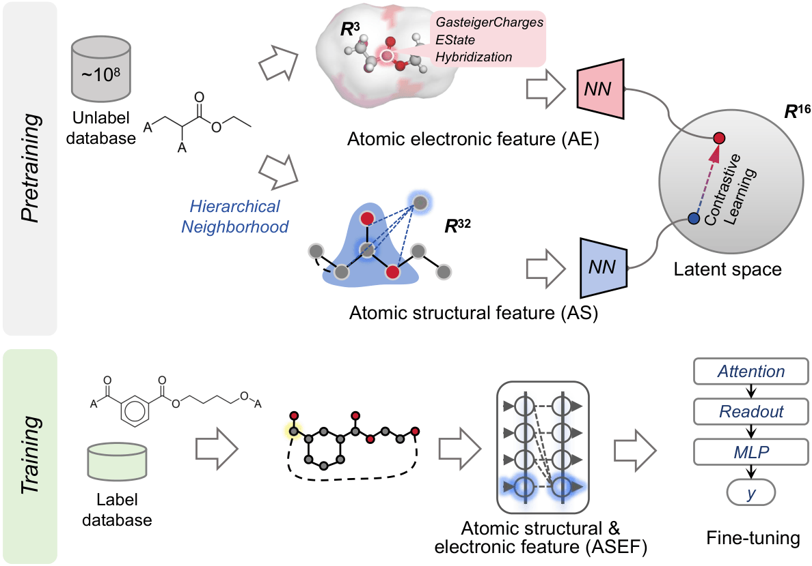

# TransChem+
**Task Example**: 

# Approach



# Datasets
The datasets used in the experiments are located in the following folder path:

```
TransChemPlus/
├── data/
```


# Dependencies
we recommend installing the following packages:

```
python == 3.12
torch == 2.10.0
torchvision == 0.25.0
torch-geometric == 2.7.0
torch_scatter == 2.1.2
numpy == 2.4.2
tqdm == 4.67.3
pandas == 3.0.1
sklearn == 1.8.0
rdkit == 2025.9.6
```

# Hyperparameter Settings
The hyperparameter settings can be found in `TransChemPlus/hyperparameter.txt`.

# Pretrained Models
The pretrained models can be found in `TransChemPlus/models`.

# Pretraining
Before pretraining, you need to set the dataset file path `csv_path` and the path where the pretrained model parameters will be saved `save_path`.
You can start training our model by using the following command:
```
cd TransChemPlus
python pretrain.py
```
# Training
Besides the dataset and saved model paths, you also need to set the path to the pretrained model for loading.
You can start training our model by using the following command:
```
cd TransChemPlus
python main.py
```
# Prediction
You can start training our model by using the following command:
```
cd TransChemPlus
python prediction.py
```
